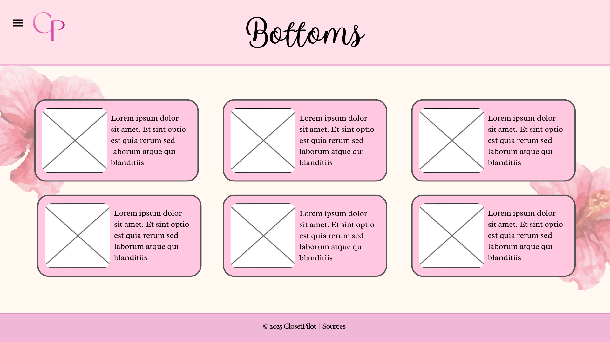
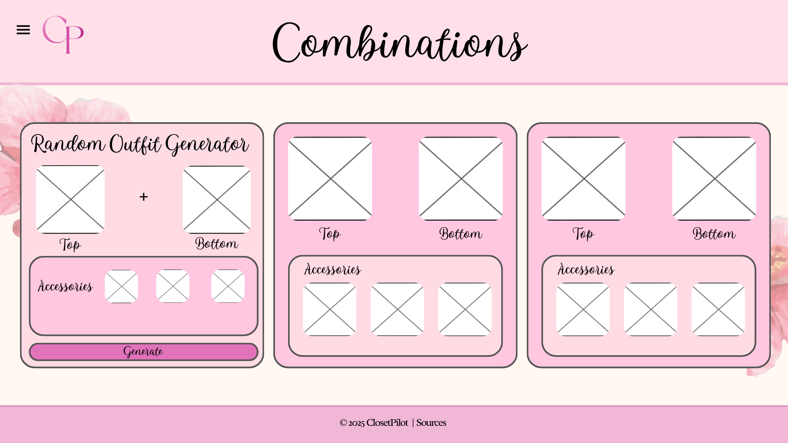

# WDProjSodiumAbalosMalang
# Closet Pilot: Know your tops, bottoms, combinations, and more!

### Logo

### Description
Closet Pilot is a website designed to put an end to the long hours you take in choosing your outfit. It’s a website made to unlock the full potential of your wardrobe by helping you decide what to wear. From a crop top to a baggy top, this site will help match your top of choice to an ideal pair of bottoms and vice versa. 
 It will suggest perfect color combinations whether you choose the color of bottoms or top first. It aims to give you a complete and appealing look every time. It can offer advice for the perfect accessories, shoes, ideal hairstyles and even suggestions for what type of bag you can use. It doesn’t matter if you’re getting ready for a casual day or a special event, Closet Pilot is the essential website for effortless yet perfectly coordinated outfits. 

### Outline
**Home page:** This page will be the main navigation for all the other webpages.

**About us:** This page gives the user a brief description of us, our style, and the way we dress.

**Tops:** This page will contain information (names, and when/where they should be worn) about the most common shirt/top types.

**Bottoms:** This page will contain information (names, and when/where they should be worn) about the most common bottoms types.

**Color Combinations:** This page contains the best and most common outfit color combinations.

**Combinations:** This page contains the most suggested combinations for each top/bottom type, as well as the accessories that would go with them. 

**Sources:** This page includes the all the sources and references we used for this project.

### JS description
In the *Combinations* page we plan to have a Random Outfit Generator, this is where we’ll use JS. For the generator, specific top and bottom styles and accessories will have a designated number. The generator will then give a random combination of 2-5 digits where each number is assigned a specific component for the outfit.

### Wireframe
**Home page (Navigation):** 

**About us:** 

**Tops:** 

**Bottoms:** 

**Color Combinations:** 

**Combinations:** 

**Sources:** 

