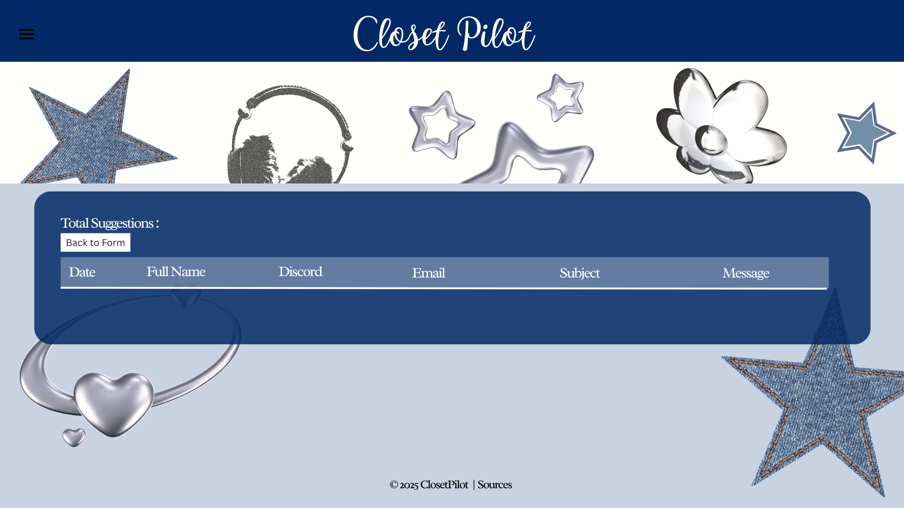
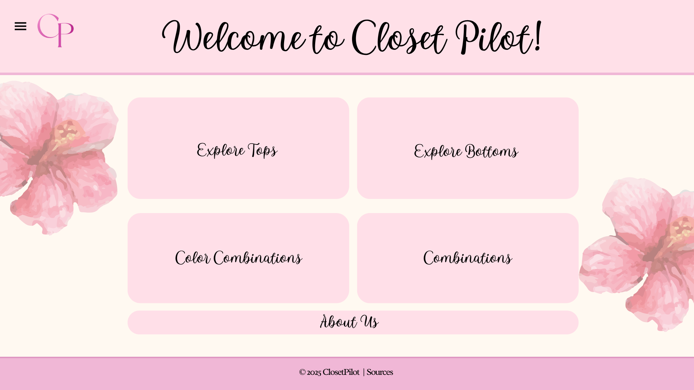
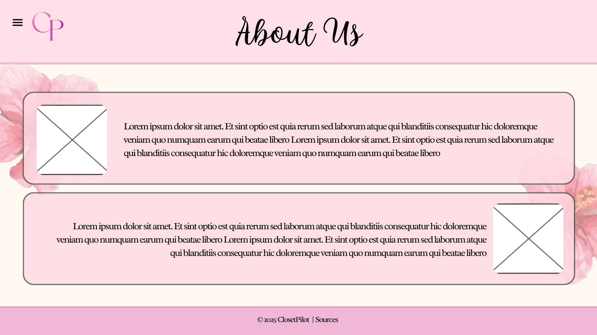
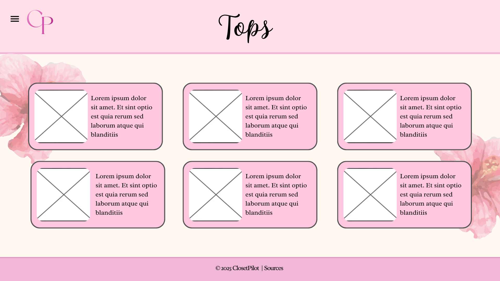
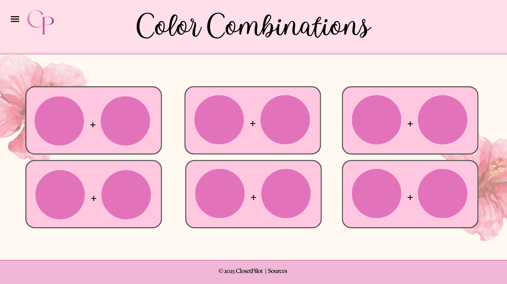
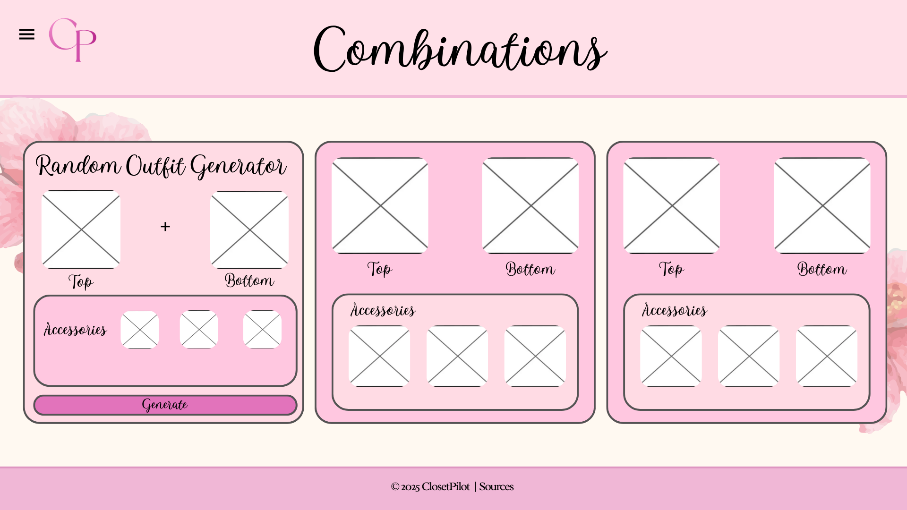
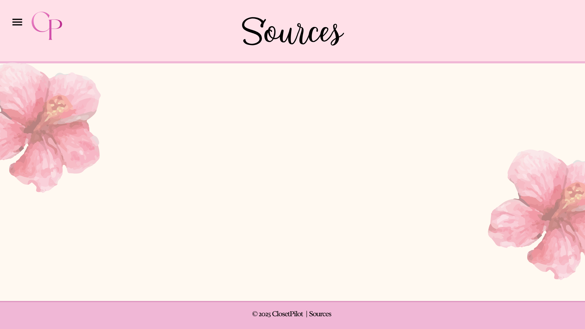

# WDProjSodiumAbalosMalang

# FINAL MODIFICATION PROPOSAL (4th Quarter Update)

## Closet Verse

## Two Sectence Description
Closet Verse is a website made to unlock the full potential of your wardrobe by helping you decide what to wear. It will help match your top of choice to an ideal pair of bottoms and vice versa, suggest the perfect color combinations, and even help you generate an outfit!

## Persona
Closet Verse is designed specifically for girls around the age of 13 - 25. One of the main things a girl focuses on is what she wears. A girls clothes is a way for them to express their personality and feelings. However,  coming from experience, we usually take up to an hour (maybe even more) to pick our outfit due to reasons such as too many options, not knowing if the outfit is right for the occasion or not being sure if it matches. 

## Reasons
They would love this project because it can be used as a tool to help them match their clothes faster.  With the help of our website, girls would be able to use their clothes to maximum potential. Lastly, the random outfit generator and the color combinations page would help in giving them good and new ideas for their outfits to ensure that they aren’t too repetitive.

## Available Features
This project includes:
- a random outfit generator (completely outfit, top only, bottom only)
- a suggestions form and list (where you can add or delete suggestions)
- multiple navigation tools (sliding hamburger menu and number key navigation)

This project <u>doesn't CURRENTLY</u> include (but might):
- a men's section
- an online photobooth
- a COMPLETE list of outfit types

## License
Proprietary/Commercial License

## KHub Requirements
The data saved in localStorage will be used to help make our website better (since it's a suggestion form).

Wireframe for the suggestions page:

##### Submitted by Zy Abalos & Anica Malang on -- to Sir Roy Canseco in partial fulfillment of the requirements of CS 3 of DOST PSHS-MC.
---

# 3rd Quarter Update
## Final Title - Closet Pilot
## 2 Sectence Description
Closet Pilot is a website made to unlock the full potential of your wardrobe by helping you decide what to wear. It will help match your top of choice to an ideal pair of bottoms and vice versa, suggest the perfect color combinations, and even help you generate an outfit!

## Features (min 3)
1. Random Outfit Generator
2. Easy navigation (side bar and number navigation)
3. Suggestions form
4. Photo booth (if time allows)

## Details 
The random outfit generator will work like this:
- All tops and bottoms will have a number assigned to them.
- A random number generator will select a number for the top and display it.
- Another random number will be selected for the bottoms (NB). 
- If the bottom assigned to NB doesn't match the top selected, it will generate a new number until it matches.

## Definition of done
The website is done when all pages are working (and look nice) and the random outfit generator works and makes sense.

## How forms will be incorporated
A suggestions page will be added for other tops/outfits/color combinations that weren't included in the original set of information.

---

# Closet Pilot: Know your tops, bottoms, combinations, and more!

### Logo

### Description
Closet Pilot is a website designed to put an end to the long hours you take in choosing your outfit. It’s a website made to unlock the full potential of your wardrobe by helping you decide what to wear. From a crop top to a baggy top, this site will help match your top of choice to an ideal pair of bottoms and vice versa. 
 It will suggest perfect color combinations whether you choose the color of bottoms or top first. It aims to give you a complete and appealing look every time. It can offer advice for the perfect accessories, shoes, ideal hairstyles and even suggestions for what type of bag you can use. It doesn’t matter if you’re getting ready for a casual day or a special event, Closet Pilot is the essential website for effortless yet perfectly coordinated outfits. 

### Outline
**Home page:** This page will be the main navigation for all the other webpages.

**About us:** This page gives the user a brief description of us, our style, and the way we dress.

**Tops:** This page will contain information (names, and when/where they should be worn) about the most common shirt/top types.

**Bottoms:** This page will contain information (names, and when/where they should be worn) about the most common bottoms types.

**Color Combinations:** This page contains the best and most common outfit color combinations.

**Combinations:** This page contains the most suggested combinations for each top/bottom type, as well as the accessories that would go with them. 

**Sources:** This page includes the all the sources and references we used for this project.

### JS description
In the *Combinations* page we plan to have a Random Outfit Generator, this is where we’ll use JS. For the generator, specific top and bottom styles and accessories will have a designated number. The generator will then give a random combination of 2-5 digits where each number is assigned a specific component for the outfit.

### Wireframe
**Home page (Navigation):** 

**About us:** 

**Tops:** 

**Bottoms:** 

**Color Combinations:** 

**Combinations:** 

**Sources:** 

